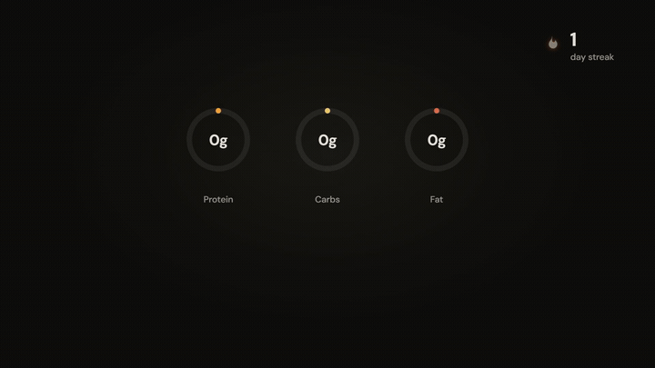
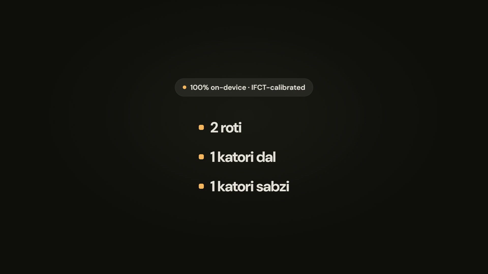

# FitMasala

A native Android app that combines an AI-powered authentic-Indian culinary
assistant with a strength-training log and an adaptive body-recomposition
planner — built for one person's own cut, running entirely on their own phone.

Everything is local-first. The only network call the app makes is to the
user's own Anthropic API key, pasted into Settings — there is no backend, no
account system, and no analytics.

## Why this exists

Most calorie trackers treat Indian food as an afterthought — "curry" as a
single catch-all, grams as the only unit, and no accounting for the things
that actually move the macros in a home-cooked Indian meal: oil absorbed
during frying, ghee in a tadka, or the difference between dry and cooked
lentil weight. FitMasala's culinary engine is prompted specifically to reason
through those cases, and every logged meal is portioned in the units people
actually use — katori, roti, plate — never forced into grams first.

The second half of the app is a cut-tracking engine that assumes the input
data is noisy — because it is. Body weight swings kilograms a day on water
alone, and photo-based calorie estimates run ±20–40%. Rather than trusting
either number directly, the app back-calculates real maintenance calories
from the *observed trend*, so a consistent estimation bias cancels out of the
deficit instead of stalling the plan.

## Demo



[](brag-output/brag.mp4)

*The loop above is a silent excerpt of the dashboard. Click the image below it
for the full 22s video with music — GitHub doesn't serve raw video with a
playable content-type, so that one downloads rather than playing inline.*

## Features

- **AI culinary assistant** — describe what's in your pantry, get an
  authentic regional recipe (not a Westernized "curry") with macros estimated
  by an LLM that's been prompted to account for frying oil, ghee, and
  dry-vs-cooked lentil weight
- **Structured, schema-validated LLM output** — every recipe and macro
  estimate is constrained by a JSON schema and cross-checked against basic
  nutritional physics (protein/carbs/fat should roughly reconcile with the
  stated calories) before it's trusted
- **Indian-unit portion logging** — katori, roti, piece, plate; grams are
  available but never the default
- **Adaptive cut planner** — a Navy-tape body-fat estimate plus a
  weight-trend engine that back-calculates true maintenance calories from
  what actually happened, not from a formula alone
- **Progressive-overload workout tracking** — logs sets/reps/weight and
  surfaces your last performance on the same lift, excluding warm-ups, so you
  always know what you're trying to beat
- **Gamification tied to the data, not bolted on** — a logging streak only
  counts a day once it clears the same "two meals logged" threshold the
  planner needs to treat that day as real data. No XP is ever awarded for a
  larger deficit — the game rewards consistency, never severity
- **Full Material 3 light + dark theming** — a proper tonal system (not a
  hand-picked palette), user-selectable in Settings, independent of system
  theme

## Architecture

Clean Architecture + MVVM, single `:app` module.

```
data/        Room (local DB), Retrofit (LLM API), DataStore (prefs),
             repository implementations
domain/      Plain Kotlin — models, repository interfaces, the plan/
             engine (body-fat estimation, weight-trend smoothing, adaptive
             TDEE, macro solving). Zero Android imports: this layer runs as
             fast JVM unit tests, no emulator required.
presentation/  Jetpack Compose screens + ViewModels, one package per
             feature (dashboard, chef, plan, settings, navigation)
core/        Design system (theme, reusable components), shared utilities
di/          Hilt modules
```

The `domain/plan` package is the part of the codebase most worth reading if
you're curious how it works — it's pure, deterministic, and every rule (why a
day needs two logged meals to count, why the deficit is capped at 25% of
maintenance, why goal-weight math accounts for lean mass lost alongside fat)
is documented next to the code that enforces it.

Design and architecture decisions — including the ones that got reversed —
are logged with dates and reasoning in [`docs/DECISIONS.md`](docs/DECISIONS.md).

## Tech stack

| Layer | Choice |
| --- | --- |
| Language | Kotlin 2.0, JVM target 17 |
| UI | Jetpack Compose, Material 3 (full tonal system, light + dark), edge-to-edge |
| DI | Hilt (KSP) |
| Persistence | Room + DataStore Preferences |
| Networking | Retrofit + OkHttp + kotlinx.serialization |
| Async | Coroutines + StateFlow |
| Build | AGP 8.13, Gradle 8.13, JDK 21 |
| Min / Target SDK | 26 / 35 |

## Building

```bash
git clone https://github.com/JamesKevinJones/FitMasala.git
cd FitMasala
./gradlew :app:assembleDebug
```

Run the test suite (pure JVM — no emulator or device needed):

```bash
./gradlew :app:testDebugUnitTest
```

On Windows, use `.\gradlew.bat` in place of `./gradlew`. See
[`docs/VERIFY.md`](docs/VERIFY.md) for the full command reference, including
instrumented (on-device) tests, and [`docs/STATE.md`](docs/STATE.md) for what
is and isn't built yet.

### Requirements

- JDK 17 or 21 (JDK 25, as bundled with recent Android Studio releases, is
  **not** yet supported by this Gradle/AGP combination)
- Android SDK, compileSdk 35
- Your own Anthropic API key, pasted into the app's Settings screen at
  runtime — the app ships with no key embedded

## Privacy

- No account, no backend, no analytics SDK
- All data — meals, workouts, weight history — stored locally in Room
- The Anthropic API key is stored in DataStore and sent only in the
  `x-api-key` header of the user's own requests to `api.anthropic.com`
- App backups are disabled at the manifest level, so the local database and
  API key are never swept into a cloud backup

## Status

Actively developed, pre-release. See [`docs/STATE.md`](docs/STATE.md) for the
current build phase and what's left before a first release.

## License

Personal project — license to be decided.
